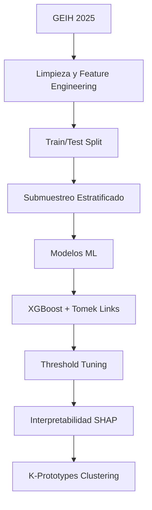

# 🚀 Determinantes de la Migración Interna en Colombia  
### Machine Learning + Econometría + Interpretabilidad SHAP sobre la GEIH 2025

<p align="center">
  
  
  
  
  
</p>

---

# 📌 Descripción del Proyecto

Este proyecto analiza los **determinantes económicos, sociales y demográficos de la migración interna en Colombia** utilizando técnicas avanzadas de **Machine Learning Interpretable** sobre microdatos de la **GEIH 2025 del DANE**.

El objetivo principal es estimar la probabilidad de que una persona migre internamente dentro del país, identificando qué factores explican dicho fenómeno desde una perspectiva económica y territorial.

El estudio combina:

- 📊 Análisis Exploratorio de Datos (EDA)
- 🤖 Modelos de clasificación supervisada
- ⚖️ Técnicas para clases desbalanceadas
- 🔍 Interpretabilidad mediante SHAP
- 🧠 Clustering K-Prototypes
- 📈 Optimización de umbral probabilístico

---

# 🎯 Pregunta de Investigación

> ¿Qué variables socioeconómicas influyen en la probabilidad de migración interna en Colombia?

---

# 🧠 Hipótesis

La migración interna en Colombia **no responde únicamente a diferencias salariales**, sino principalmente a:

- Falta de formalidad laboral
- Exclusión del sistema de salud
- Vulnerabilidad institucional
- Características demográficas como juventud e inactividad laboral

---

# 🗂️ Dataset

### Fuente:
- Gran Encuesta Integrada de Hogares (GEIH) — DANE 2025

### Tamaño:
- 🧾 Más de **3 millones de registros**
- 📌 Más de **20 variables socioeconómicas**

### Variable Objetivo:
| Variable | Descripción |
|---|---|
| `Migró` | 1 = Migró internamente / 0 = No migró |

### Desbalance:
- Solo el **2.53%** de la muestra corresponde a migrantes.

---

# ⚙️ Pipeline del Proyecto



---

# 🧪 Modelos Evaluados

| Modelo | Objetivo |
|---|---|
| Regresión Logística | Baseline interpretable |
| Árbol de Decisión | Relaciones no lineales |
| Random Forest | Ensemble robusto |
| XGBoost | Modelo campeón |

---

# ⚖️ Manejo del Desbalance de Clases

Debido a que los migrantes representan solo el **2.53%** de la muestra, se implementaron técnicas especializadas:

## 🔹 Tomek Links
Elimina observaciones ambiguas entre clases para mejorar la separación estadística.

## 🔹 Cluster Centroids
Reduce la clase mayoritaria mediante centroides.

## 🔹 Scale Pos Weight
Penalización adicional a errores sobre la clase minoritaria en XGBoost.

---

# 🏆 Modelo Campeón

## ✅ XGBoost + Tomek Links

### Métricas Finales

| Métrica | Resultado |
|---|---|
| ROC-AUC | **0.7663** |
| PR-AUC | **0.1102** |
| Recall | **0.7469** |
| Precision | **0.0498** |
| F1-Score | **0.0934** |
| Umbral Óptimo | **0.4541** |

---

# 📈 Resultados Clave

## 🔥 Hallazgos Económicos

### 1️⃣ La afiliación a salud es el principal factor de retención territorial
Más importante incluso que el ingreso monetario.

### 2️⃣ La migración se concentra en población joven
Principalmente entre:
- 18–45 años
- Personas en edad productiva

### 3️⃣ Bogotá y Antioquia siguen siendo polos de atracción
Concentrando gran parte de los flujos migratorios internos.

### 4️⃣ La informalidad laboral impulsa movilidad territorial
La exclusión institucional aumenta significativamente la probabilidad de migrar.

---

# 🔍 Interpretabilidad con SHAP

El proyecto incorpora valores SHAP para explicar cómo cada variable afecta individualmente la probabilidad predicha por el modelo.

## Variables más importantes:

- Edad
- Departamento de origen
- Afiliación a salud
- Nivel educativo
- Ingreso
- Condición laboral

---

# 🧠 Clustering de Migrantes

Se implementó **K-Prototypes Clustering** para identificar perfiles migratorios combinando:

- Variables numéricas
- Variables categóricas

## Algunos perfiles encontrados:

| Cluster | Perfil |
|---|---|
| 0 | Jóvenes urbanos informales |
| 1 | Adultos rurales vulnerables |
| 2 | Hogares familiares migrantes |
| 3 | Trabajadores formales urbanos |

---

# 📊 Tecnologías Utilizadas

```python
Python
Pandas
NumPy
Scikit-Learn
XGBoost
SHAP
Matplotlib
Seaborn
Imbalanced-Learn
KModes
GeoPandas
```

---

# 🏗️ Estructura del Proyecto

```bash
📂 migracion-colombia-ml
│
├── 📁 data
├── 📁 notebooks
├── 📁 models
├── 📁 outputs
├── 📁 visualizations
├── README.md
└── requirements.txt
```

---

# 🚀 Cómo Ejecutarlo

## 1️⃣ Clonar repositorio

```bash
git clone https://github.com/tuusuario/migracion-colombia-ml.git
```

## 2️⃣ Instalar dependencias

```bash
pip install -r requirements.txt
```

## 3️⃣ Ejecutar notebook principal

```bash
jupyter notebook
```

---

# 🧾 Conclusiones

Este proyecto demuestra que la migración interna en Colombia:

✅ Es un fenómeno altamente relacionado con la exclusión institucional  
✅ Puede modelarse exitosamente mediante Machine Learning  
✅ Requiere políticas públicas enfocadas en formalización y cobertura social  
✅ No depende únicamente de diferencias salariales

---

# 📌 Recomendación de Política Pública

> Focalizar programas de formalización laboral y expansión de cobertura en salud en departamentos expulsores como mecanismo de retención territorial.

---

# 👨‍💻 Autores

- Juan Esteban Samaniego
- Alan Steven Ríos Munar
- Sebastian Casas Poloche

### Universidad Externado de Colombia  
IA con Aplicaciones en Economía — 2026

---

# ⭐ Si te gustó este proyecto...

¡Dale estrella al repositorio y compártelo! 🚀
